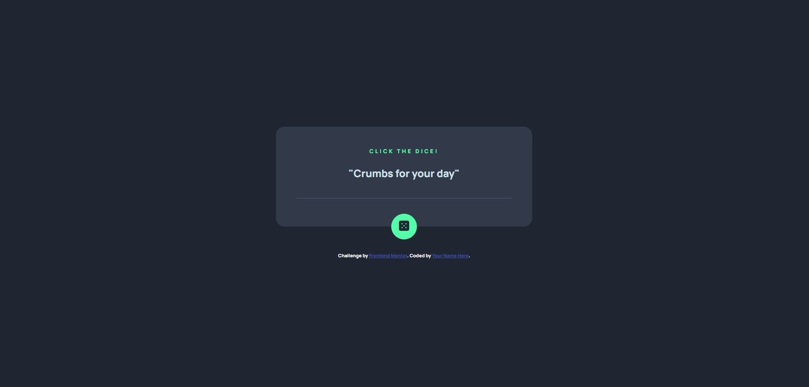
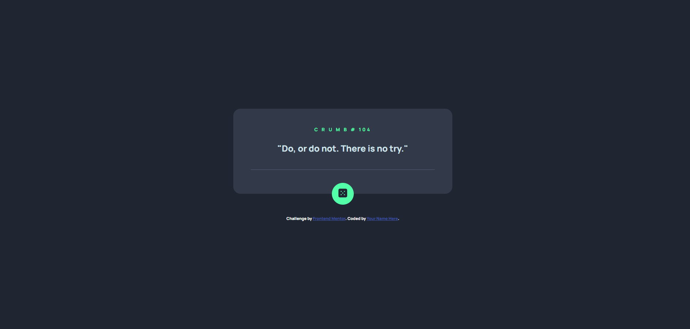

# Frontend Mentor - Advice generator app solution

This is a solution to the [Advice generator app challenge on Frontend Mentor](https://www.frontendmentor.io/challenges/advice-generator-app-QdUG-13db). Frontend Mentor challenges help you improve your coding skills by building realistic projects.

## Table of contents

- [Overview](#overview)
  - [The challenge](#the-challenge)
  - [Screenshot](#screenshot)
  - [Links](#links)
- [My process](#my-process)
  - [Built with](#built-with)
  - [What I learned](#what-i-learned)
- [Author](#author)

## Overview

### The challenge

Users should be able to:

- View the optimal layout for the app depending on their device's screen size
- See hover states for all interactive elements on the page
- Generate a new piece of advice by clicking the dice icon

### Screenshot

### Links
- Live Site URL: [(https://ash-dev-crumb-generator.vercel.app)]

## My process

The first thing I did was to write the HTML structure then proceeded to write the styles while referring to the style guide provided by front-end mentor. After that I wrote the Javascript for the generate button. Researching how the advice api works helped me implement it to my project.

### Built with

- Semantic HTML5 markup
- CSS custom properties
- Flexbox
- CSS Grid
- Desktop-first workflow
- Javascipt Advice API

### What I learned

The most valuable lesson I learned while doing this project was how to implement Javascript APIs. 

## Author

- Facebook - [@trishacapitle01](https://www.facebook.com/trishacapitle01/)

